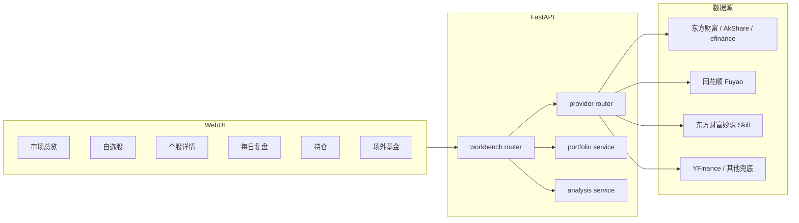

<div align="center">

# AI 股票复盘工作台

**一个面向普通 A 股用户的 AI 复盘、行情、持仓与基金分析工作台。**

[](LICENSE)
[](https://www.python.org/)
[](https://react.dev/)
[](https://fastapi.tiangolo.com/)
[](docker/)

市场总览 · 自选股 · 个股详情 · 每日复盘 · 持仓建议 · ETF · 场外基金

> 本仓库基于开源项目 [ZhuLinsen/daily_stock_analysis](https://github.com/ZhuLinsen/daily_stock_analysis) 做最小改造增强，并参考 [ArvinLovegood/go-stock](https://github.com/ArvinLovegood/go-stock) 的工作台体验，面向“看得懂、用得上、可复盘”的普通投资者场景。

</div>

---

## 这是什么

AI 股票复盘工作台不是量化交易终端，也不是荐股软件。它更像一个每天收盘后打开的“复盘桌面”：把指数、板块、自选股、个股 K 线、资金流、AI 分析、持仓风险和场外基金数据放到一个界面里，用普通话给出可读的观察清单。

项目尽量复用 `daily_stock_analysis` 原有能力：多数据源行情、LLM 分析、Markdown 报告、FastAPI、WebUI、Docker、定时任务和企业微信/飞书/邮件等推送能力。在此基础上补齐更适合 A 股用户的四个核心页面，并新增东方财富、同花顺 Fuyao、东方财富妙想 Skill、ETF 和场外基金分析支持。


## 核心亮点

| 能力 | 说明 |
| --- | --- |
| 市场总览 Dashboard | 展示上证指数、深证成指、创业板指、成交额、涨跌家数、涨跌停、强势行业、强势概念和 AI 市场情绪总结。 |
| 自选股 Watchlist | 展示股票代码、名称、最新价、涨跌幅、成交额、换手率、主力净流入、行业/概念、AI 评分和状态标签。 |
| 个股详情 StockDetail | 集成顶部行情卡、ECharts K 线、成交量、MA/MACD/KDJ/RSI/BOLL、资金流、AI 评分卡、风险提示和 AI 报告。 |
| 每日复盘 DailyReview | 输出今日市场一句话、最强板块、风险板块、自选股表现、明日观察清单和可导出的 Markdown 复盘。 |
| 持仓操作建议卡 | 按当前盈亏、仓位占比、AI 评分和风险标签，为每个持仓生成“持有/减仓/加仓等待/止损观察”的普通话解释。 |
| 建仓参考 | 按预算估算观察价、挂单参考价、手数、触发条件和失效条件，只做复盘参考，不做自动交易。 |
| ETF 支持 | 将 ETF 纳入行情、K 线、建仓参考和工作台展示，按 ETF 交易单位做更贴近实际的估算。 |
| 场外基金分析 | 支持净值走势、阶段收益、最大回撤、盘中估值、同类排名、前十大持仓和持仓行业。 |
| 多数据源容错 | 新增数据源统一返回 `source / stale / error`，单个接口失败不会导致页面崩溃。 |
| AI 免责声明 | 所有 AI 分析、建仓参考、持仓处理和基金申购参考均带“不构成投资建议”声明。 |

## 页面一览

### 1. 市场总览

用一屏了解今天市场温度：指数是否共振、成交额是否放大、涨跌家数是否健康、强势方向集中在哪些行业和概念。

### 2. 自选股

面向日常跟踪的自选股表格。除了基础行情，还会给出 AI 评分、状态标签和一万元预算下的建仓参考。

状态标签包括：`强势突破`、`趋势持有`、`缩量等待`、`高位风险`、`破位减仓`、`资金流出`、`等待确认`。

### 3. 个股详情

以普通投资者能理解的方式组织 K 线、成交量、均线、MACD、KDJ、RSI、BOLL、资金流、行业概念、风险提示和明日观察位。

### 4. 每日复盘

将市场、板块、自选股和真实持仓汇总成一份复盘报告，支持导出 Markdown，方便沉淀到笔记或知识库。

### 5. 持仓与基金

持仓页提供更简单的持仓导入、实时盈亏、仓位集中度和持仓操作建议卡。基金页支持场外基金净值、估值、回撤、排名、持仓行业和前十大持仓。

## 技术架构



后端以 FastAPI 为服务入口，`ProviderRouter` 负责统一调度东方财富、同花顺、妙想、AkShare、efinance、YFinance 等数据源；前端基于 React + TypeScript + ECharts，尽量用卡片、表格和标签表达复杂信息。

## 快速开始

### Docker 运行

```bash
git clone https://github.com/zqj372-ops/daily_stock_analysis_workbench.git
cd daily_stock_analysis_workbench
cp .env.example .env

# 编辑 .env，至少配置 STOCK_LIST 和一个可用 LLM Key
docker compose -f docker/docker-compose.yml -f docker/docker-compose.local.yml up -d --build server
```

启动后访问：`http://127.0.0.1:8000`

### 本地开发

```bash
git clone https://github.com/zqj372-ops/daily_stock_analysis_workbench.git
cd daily_stock_analysis_workbench

python -m venv .venv
source .venv/bin/activate
pip install -r requirements.txt
cp .env.example .env

# 后端
python main.py --webui

# 前端开发模式，可选
cd apps/dsa-web
npm install
npm run dev
```

常用命令：

```bash
python main.py --serve-only       # 只启动 API / Web 服务
python main.py --webui            # 启动 WebUI
python main.py --stocks 600519    # 手动分析单只股票
python main.py --market-review    # 大盘复盘
python main.py --schedule         # 定时任务
```

## 关键环境变量

| 变量 | 用途 | 必填 |
| --- | --- | :---: |
| `STOCK_LIST` | 自选股列表，如 `600519,300750,510300` | 是 |
| `OPENAI_API_KEY` / `DEEPSEEK_API_KEY` / `GEMINI_API_KEY` 等 | LLM 分析 | 任选其一 |
| `FUYAO_API_KEY` | 同花顺 Fuyao 金融 API，用于行情快照、指数、板块等 | 可选 |
| `MX_APIKEY` | 东方财富妙想 Skill API，用于妙想数据查询、资讯搜索、智能选股等 | 可选 |
| `TUSHARE_TOKEN` | Tushare 数据源 | 可选 |
| `WECHAT_WEBHOOK_URL` / `FEISHU_WEBHOOK_URL` / `EMAIL_*` | 推送渠道 | 可选 |

更多配置请看 [.env.example](.env.example) 和 [完整配置指南](docs/full-guide.md)。请勿将真实 API Key、Webhook、数据库文件、持仓明细或 `.env` 提交到公开仓库。

## API 示例

```bash
# 市场总览
curl http://127.0.0.1:8000/api/v1/workbench/dashboard

# 自选股，按 10000 元预算生成建仓参考
curl 'http://127.0.0.1:8000/api/v1/workbench/watchlist?entry_budget=10000'

# 个股详情
curl http://127.0.0.1:8000/api/v1/workbench/stocks/600519

# 持仓操作建议卡
curl http://127.0.0.1:8000/api/v1/workbench/portfolio-actions

# 场外基金分析
curl http://127.0.0.1:8000/api/v1/workbench/funds/000001?budget=10000
```

如果开启了 Web 登录认证，浏览器页面会走登录态；直接请求 API 需要按项目认证配置提供凭据。

## 模块来源与开源说明

本仓库是面向 AI 股票复盘工作台场景的二次开发版本，主要模块来源如下：

| 模块 | 来源 / 参考 | 说明 |
| --- | --- | --- |
| 基础后端、调度、推送、LLM 分析、原 WebUI | [ZhuLinsen/daily_stock_analysis](https://github.com/ZhuLinsen/daily_stock_analysis) | 本项目的主体基础，保留 MIT License。 |
| 工作台 UI 体验参考 | [ArvinLovegood/go-stock](https://github.com/ArvinLovegood/go-stock) | 参考其卡片式工作台、行情/自选/设置等产品体验，未直接复制代码。 |
| 东方财富 Provider | `data_provider/eastmoney_provider.py`、`data_provider/fund_provider.py` | 基于 AkShare、efinance 和东方财富公开页面/接口做封装，统一 fail-open 返回。 |
| 同花顺 Provider | `data_provider/ths_provider.py`、`skills/ths_skill/` | 通过 Fuyao API 和本地缓存补充指数、快照、行业、概念、题材归因。 |
| 东方财富妙想 Skill | `skills/mx-skills/` | 来自东方财富妙想 Skill 包，需用户自行配置 `MX_APIKEY`，仅用于数据查询、资讯搜索、智能选股和自选股管理复盘。 |
| 前端工作台 | `apps/dsa-web/src/pages/Workbench*.tsx`、`components/workbench/` | React + TypeScript + ECharts 实现市场总览、自选股、个股详情、每日复盘、基金页等。 |
| 持仓操作建议卡 | `src/services/workbench_service.py`、`PortfolioPage.tsx` | 基于已有持仓快照、盈亏、仓位和风险标签的规则化解释，不调用券商、不自动交易。 |
| 第三方开源依赖 | `requirements.txt`、`apps/dsa-web/package.json` | 包括 FastAPI、SQLAlchemy、AkShare、efinance、pandas、LiteLLM、React、ECharts、Vite 等。 |

所有第三方库版权归原作者所有，请遵守其各自许可证、服务条款和数据使用限制。本仓库只做学习、研究和个人复盘用途，不提供证券交易服务。

## 项目结构

```text
daily_stock_analysis/
├── api/                    # FastAPI 路由与 Pydantic schema
├── apps/dsa-web/           # React + TypeScript Web 工作台
├── data_provider/          # 东方财富、同花顺、基金、ETF 等数据源封装
├── skills/                 # eastmoney_skill / ths_skill / mx-skills
├── src/services/           # 分析、工作台、持仓、风险等业务服务
├── docker/                 # Dockerfile 与 compose 配置
├── docs/                   # 使用文档、部署文档和发布说明
└── tests/                  # Python 测试
```

## 设计原则

- 不做自动交易，不接券商接口，不承诺收益。
- 优先展示普通用户能看懂的信息，而不是复杂专业量化终端。
- 数据源失败要降级，单个接口异常不能拖垮整个页面。
- AI 输出必须有免责声明，建仓/持仓/基金建议都只作为复盘参考。
- 默认浅色模式，保留深色模式扩展点。

## 路线图

- [x] AI 股票复盘工作台四页面 MVP
- [x] 东方财富 / 同花顺 Provider 接入
- [x] ECharts K 线与资金流图表
- [x] ETF 数据支持
- [x] 持仓操作建议卡
- [x] 场外基金净值、估值、排名、持仓行业
- [ ] 更完整的异常监控与数据源健康面板
- [ ] 更细的自选股分组、标签和导入体验
- [ ] 更丰富的基金同类对比和指数基准
- [ ] 移动端布局进一步打磨

## 文档

- [完整配置与部署指南](docs/full-guide.md)
- [AI 股票复盘工作台 MVP 发布说明](docs/releases/ai-stock-workbench-mvp.md)
- [市场支持边界](docs/market-support.md)
- [LLM 配置指南](docs/LLM_CONFIG_GUIDE.md)
- [桌面端打包说明](docs/desktop-package.md)

## 贡献

欢迎提交 Issue 和 PR。比较适合贡献的方向包括：数据源适配、前端交互、报表模板、持仓导入格式、基金数据质量、文档和部署脚本。

提交前建议至少运行：

```bash
python -m compileall api data_provider src
cd apps/dsa-web && npm run build
```

## License

本项目沿用 [MIT License](LICENSE)。原始项目、参考项目、第三方依赖和外部数据服务均归其各自作者或权利方所有。

## 免责声明

本项目仅供学习、研究和个人复盘使用，不构成任何投资建议、收益承诺或交易指令。股票、ETF、基金等金融产品均存在风险，投资需谨慎。使用者应自行核验数据来源、接口时效和分析结论，并独立承担投资决策责任。
