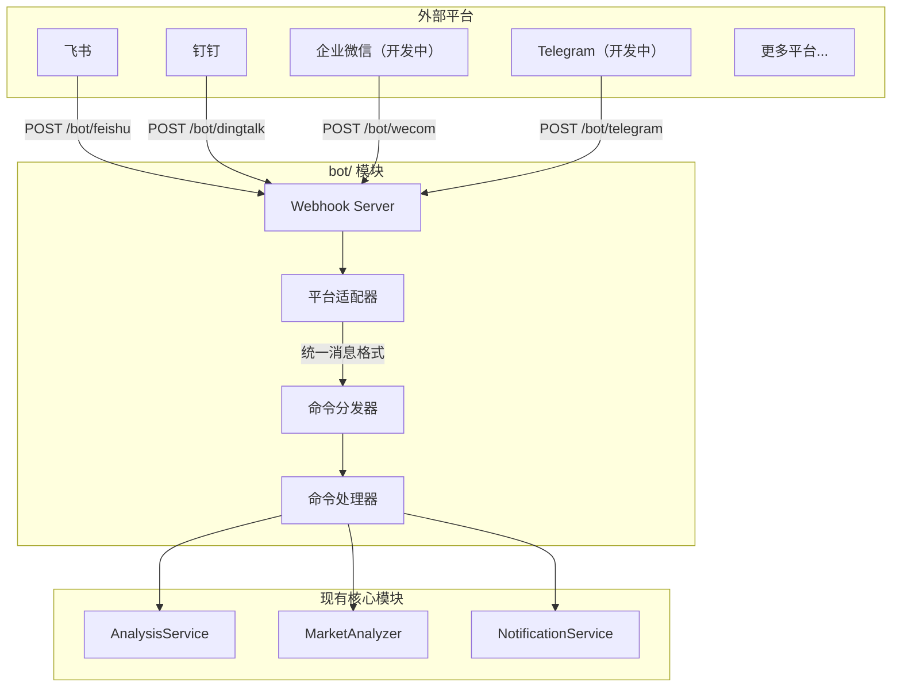

## 1. Gesamtarchitektur




## 2. Verzeichnisstruktur

Erstelle im Projektstammverzeichnis ein `bot/`-Verzeichnis:

```
bot/
├── __init__.py             # 模块入口，导出主要类
├── models.py               # 统一的消息/响应模型
├── dispatcher.py           # 命令分发器（核心）
├── commands/               # 命令处理器
│   ├── __init__.py
│   ├── base.py             # 命令抽象基类
│   ├── analyze.py          # /analyze 股票分析
│   ├── market.py           # /market 大盘复盘
│   ├── help.py             # /help 帮助信息
│   └── status.py           # /status 系统状态
└── platforms/              # 平台适配器
    ├── __init__.py
    ├── base.py             # 平台抽象基类
    ├── feishu.py           # 飞书机器人
    ├── dingtalk.py         # 钉钉机器人
    ├── dingtalk_stream.py  # 钉钉机器人Stream
    ├── wecom.py            # 企业微信机器人 （开发中）
    └── telegram.py         # Telegram 机器人 （开发中）
```

## 3. Kern-Abstraktionsdesign

### 3.1 Einheitliches Nachrichtenmodell (`bot/models.py`)

```python
@dataclass
class BotMessage:
    """统一的机器人消息模型"""
    platform: str           # 平台标识: feishu/dingtalk/wecom/telegram
    user_id: str            # 发送者 ID
    user_name: str          # 发送者名称
    chat_id: str            # 会话 ID（群聊或私聊）
    chat_type: str          # 会话类型: group/private
    content: str            # 消息文本内容
    raw_data: Dict          # 原始请求数据（平台特定）
    timestamp: datetime     # 消息时间
    mentioned: bool = False # 是否@了机器人

@dataclass
class BotResponse:
    """统一的机器人响应模型"""
    text: str               # 回复文本
    markdown: bool = False  # 是否为 Markdown
    at_user: bool = True    # 是否@发送者
```

### 3.2 Basisklasse für Plattform-Adapter (`bot/platforms/base.py`)

```python
class BotPlatform(ABC):
    """平台适配器抽象基类"""
    
    @property
    @abstractmethod
    def platform_name(self) -> str:
        """平台标识名称"""
        pass
    
    @abstractmethod
    def verify_request(self, headers: Dict, body: bytes) -> bool:
        """验证请求签名（安全校验）"""
        pass
    
    @abstractmethod
    def parse_message(self, data: Dict) -> Optional[BotMessage]:
        """解析平台消息为统一格式"""
        pass
    
    @abstractmethod
    def format_response(self, response: BotResponse) -> Dict:
        """将统一响应转换为平台格式"""
        pass
```

### 3.3 Basisklasse für Befehle (`bot/commands/base.py`)

```python
class BotCommand(ABC):
    """命令处理器抽象基类"""
    
    @property
    @abstractmethod
    def name(self) -> str:
        """命令名称 (如 'analyze')"""
        pass
    
    @property
    @abstractmethod
    def aliases(self) -> List[str]:
        """命令别名 (如 ['a', '分析'])"""
        pass
    
    @property
    @abstractmethod
    def description(self) -> str:
        """命令描述"""
        pass
    
    @property
    @abstractmethod
    def usage(self) -> str:
        """使用说明"""
        pass
    
    @abstractmethod
    async def execute(self, message: BotMessage, args: List[str]) -> BotResponse:
        """执行命令"""
        pass
```

### 3.4 Befehls-Dispatcher (`bot/dispatcher.py`)

```python
class CommandDispatcher:
    """命令分发器 - 单例模式"""
    
    def __init__(self):
        self._commands: Dict[str, BotCommand] = {}
        self._aliases: Dict[str, str] = {}
    
    def register(self, command: BotCommand) -> None:
        """注册命令"""
        self._commands[command.name] = command
        for alias in command.aliases:
            self._aliases[alias] = command.name
    
    def dispatch(self, message: BotMessage) -> BotResponse:
        """分发消息到对应命令"""
        # 1. 解析命令和参数
        # 2. 查找命令处理器
        # 3. 执行并返回响应
```

## 4. Unterstützte Befehle

| Befehl | Aliase | Beschreibung | Beispiel |
|------|------|------|------|
| /analyze | /a, analyse | Analysiert eine bestimmte Aktie | `/analyze 600519` |
| /market | /m, markt | Markt-Rückblick | `/market` |
| /batch | /b, batch | Analysiert die Watchlist in Batches | `/batch` |
| /help | /h, hilfe | Zeigt Hilfeinformationen | `/help` |
| /status | /s, status | Systemstatus | `/status` |

## 5. `/status` und Hinweise zur Diagnose der Modellkonfiguration

### Konfigurierbare Ebenen und Kriterien zur Verfügbarkeitsbeurteilung

- Die von `/status` angezeigte LLM-Verfügbarkeit folgt der einheitlichen Laufzeit-Priorität des Systems:
  - `LITELLM_CONFIG` (LiteLLM YAML)
  - `LLM_CHANNELS`
  - Legacy-Provider-Schlüssel (`GEMINI_API_KEY` / `OPENAI_API_KEY` / `ANTHROPIC_API_KEY` / `DEEPSEEK_API_KEY`)
- Wenn für das Hauptmodell (`LITELLM_MODEL` oder `AGENT_LITELLM_MODEL`) in der aktuell aktiven Ebene keine verfügbare Quelle existiert, wird „AI-Dienst nicht konfiguriert“ angezeigt und eine für den Nutzer sichtbare Begründungszeile beibehalten.
- Die Laufzeit-Abhängigkeitsbeschränkung in der `requirements.txt` dieses Repos lautet `litellm>=1.80.10,!=1.82.7,!=1.82.8,<2.0.0`; innerhalb dieser Einschränkung gilt für diese Kette das bestehende Kompatibilitätsverhalten.
- Diese Diagnoseregel entspricht der LLM-Prüfung von `GET /api/v1/system/config/setup/status`: `LITELLM_CONFIG`/`LLM_CHANNELS` haben hohe Priorität; beim Wechsel des Modus wird keine stille Migration durchgeführt. Beim Zurückwechseln in den alten Modus stellt der Nutzer historische Werte explizit wieder her oder führt einen Rollback durch.

### Grenzen von Fallback und Migration

- Wenn entweder `LITELLM_CONFIG` oder `LLM_CHANNELS` aktiv ist, wird die darunterliegende Legacy-Konfiguration von dieser Ebene ignoriert (sie dient nicht mehr als Quelle für den Aufruf).
- Die verbesserte Diagnose führt keine stille Migration durch: Historische Werte von `GEMINI_*`, `OPENAI_*`, `ANTHROPIC_*`, `LITELLM_*` werden nicht automatisch geleert/gelöscht, sondern nur im Rahmen der Verfügbarkeitsdiagnose gemeldet.

### Offizielle kompatible Quellen (zur Fehlerbehebung)

- LiteLLM-Website: <https://docs.litellm.ai/>
- LiteLLM OpenAI-Compatible-Erläuterung: <https://docs.litellm.ai/docs/providers/openai_compatible>
- OpenAI Chat API: <https://platform.openai.com/docs/api-reference/chat>
- DeepSeek-API-Dokumentation: <https://api-docs.deepseek.com/>
- Kimi Moonshot Kompatibilitätshinweis: <https://platform.moonshot.ai/docs/guide/compatibility>
- Gemini OpenAI-Kompatibilitätshinweis: <https://ai.google.dev/gemini-api/docs/openai>
- Ollama-API-Dokumentation: <https://github.com/ollama/ollama/blob/main/docs/api.md>

## 6. Webhook-Routen

Routen in [api/v1/router.py](../api/v1/router.py) registrieren:

```python
# Webhook 路由
/bot/feishu      # POST - 飞书事件回调
/bot/dingtalk    # POST - 钉钉事件回调
/bot/wecom       # POST - 企业微信事件回调 （开发中）
/bot/telegram    # POST - Telegram 更新回调 （开发中）
```

## Konfiguration

Roboterkonfiguration in [config.py](../src/config.py) ergänzen:

```python
# === 机器人配置 ===
bot_enabled: bool = False              # 是否启用机器人
bot_command_prefix: str = "/"          # 命令前缀

# 飞书机器人（事件订阅）
feishu_app_id: str                     # 已有
feishu_app_secret: str                 # 已有
feishu_verification_token: str         # 新增：事件校验 Token
feishu_encrypt_key: str                # 新增：加密密钥

# 钉钉机器人（应用）
dingtalk_app_key: str                  # 新增
dingtalk_app_secret: str               # 新增

# 企业微信机器人（开发中）
wecom_token: str                       # 新增：回调 Token
wecom_encoding_aes_key: str            # 新增：EncodingAESKey

# Telegram 机器人（开发中）
telegram_bot_token: str                # 已有
telegram_webhook_secret: str           # 新增：Webhook 密钥
```

## Erweiterungshinweise
### So fügst du eine neue Benachrichtigungsplattform hinzu

1. Erstelle eine neue Datei in `bot/platforms/`
2. Erbe die Basisklasse `BotPlatform`
3. Implementiere `verify_request`, `parse_message`, `format_response`
4. Registriere den Webhook-Endpunkt in der Route

### So fügst du einen neuen Befehl hinzu

1. Erstelle eine neue Datei in `bot/commands/`
2. Erbe die Basisklasse `BotCommand`
3. Implementiere die Methode `execute`
4. Registriere den Befehl im Dispatcher

## Sicherheitsbezogene Konfiguration

- Unterstützt die Begrenzung der Befehlsfrequenz (Schutz vor Spam)
- Für sensible Operationen (z. B. Batch-Analyse) kann eine Berechtigungs-Whitelist eingerichtet werden

Sicherheitskonfiguration für den Bot in [config.py](../src/config.py) ergänzen:

```python
    bot_rate_limit_requests: int = 10     # 频率限制：窗口内最大请求数
    bot_rate_limit_window: int = 60       # 频率限制：窗口时间（秒）
    bot_admin_users: List[str] = field(default_factory=list)  # 管理员用户 ID 列表，限制敏感操作
```
