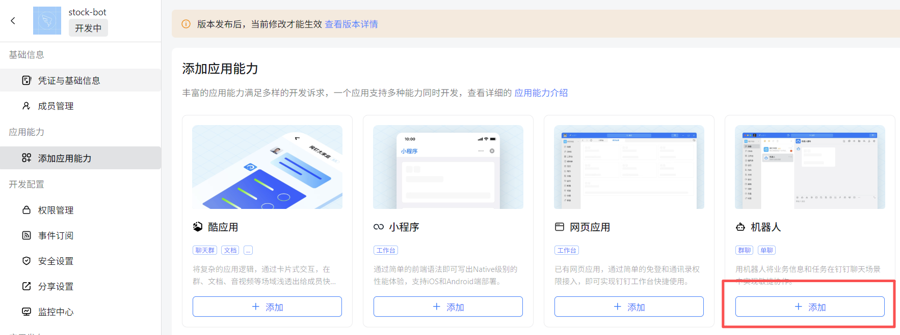
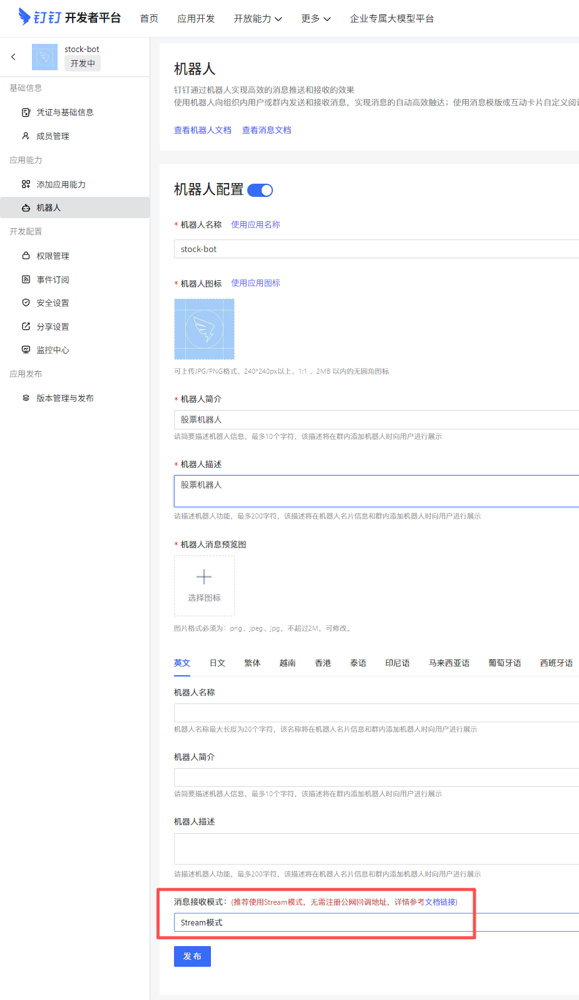
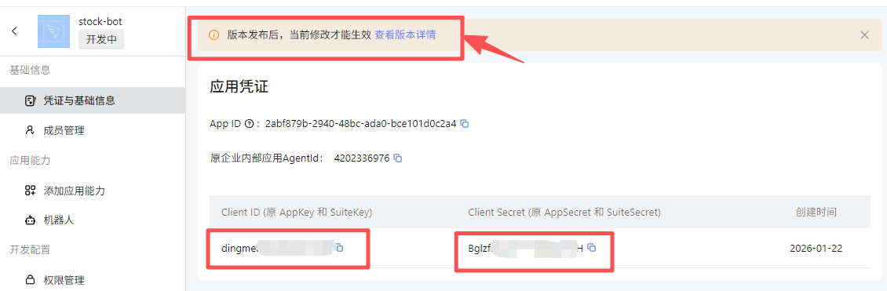
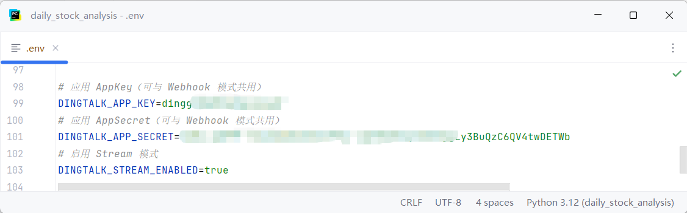
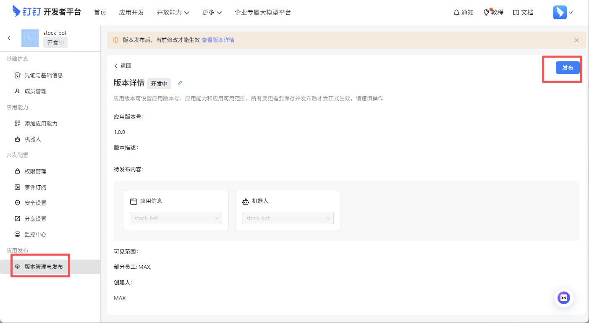
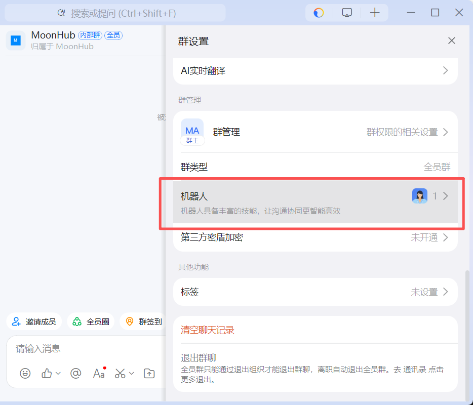
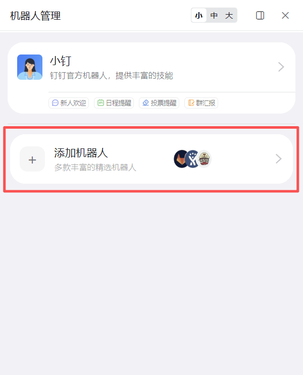
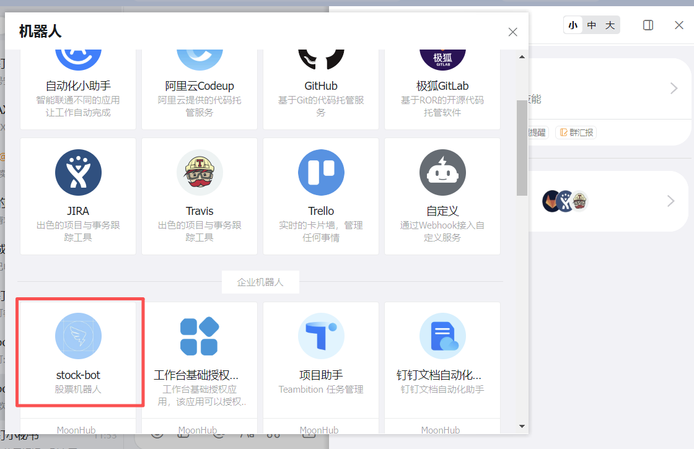
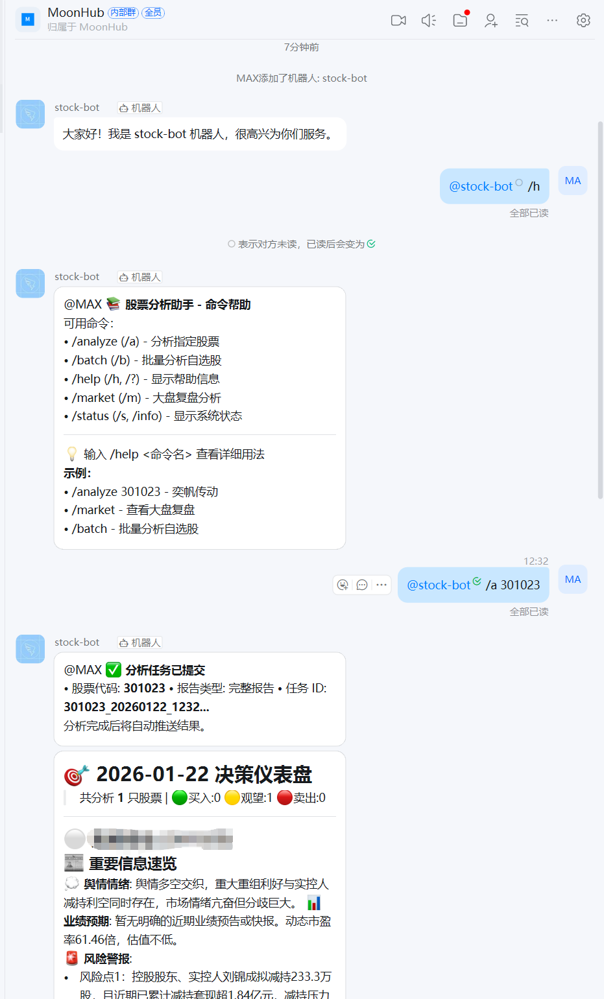

# DingTalk-Unternehmensbot-Konfiguration

## DingTalk-Bot
Damit der DingTalk-Bot Nachrichten empfangen kann, wird die Unternehmensbot-Fähigkeit benötigt.
https://open.dingtalk.com/document/dingstart/configure-the-robot-application

Beim Empfangen von Nachrichten gibt es den `Http-Modus` (erfordert eine öffentliche Adresse) und den `Stream-Modus`; der `Stream-Modus` wird empfohlen.

Schritte zum Erstellen einer App: https://open.dingtalk.com/document/dingstart/create-application

App-Entwicklung > Interne Unternehmensapp > DingTalk-App > App erstellen > App-Fähigkeit hinzufügen > Bot

### Bot hinzufügen

### Bot zur Verwendung des Stream-Modus konfigurieren

### Anmeldeinformationen der App abrufen

### DingTalk-Anmeldeinformationen konfigurieren
Trage die Anmeldeinformationen der DingTalk-App in die Konfigurationsdatei ein.

### App veröffentlichen

### Beim Scrollen weiter unten siehst du den hinzugefügten Unternehmensbot

### Bot-Befehle testen

