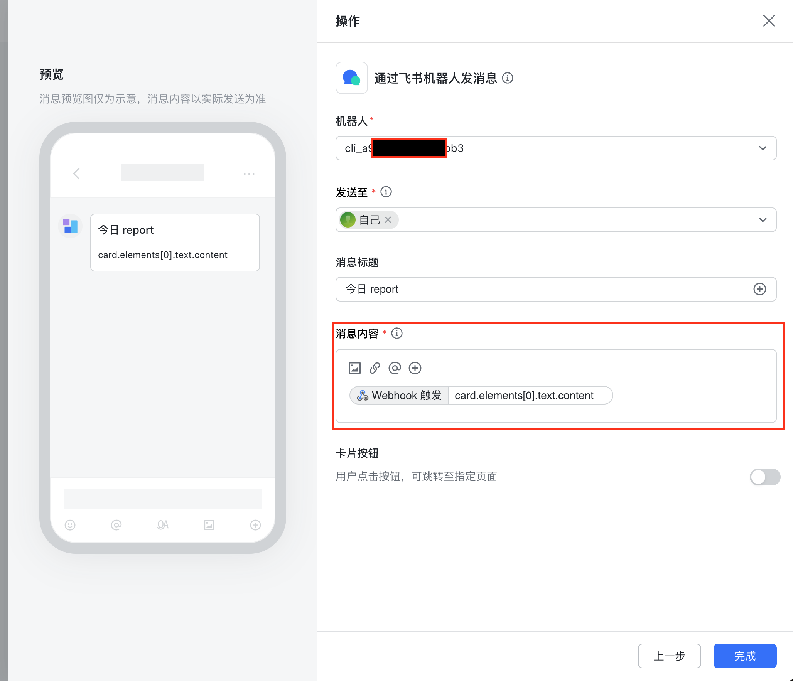
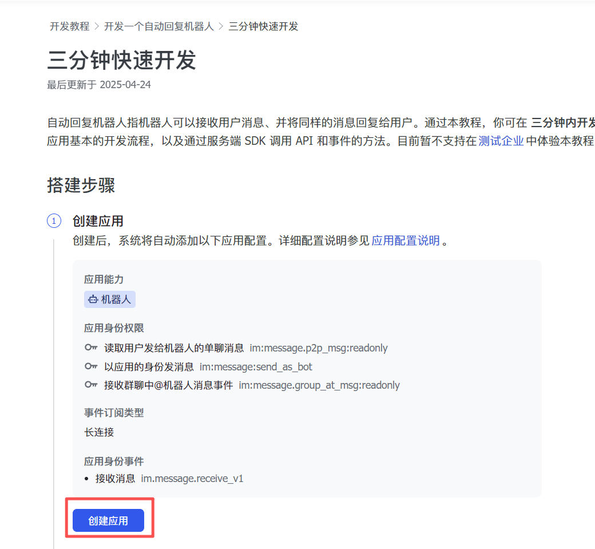
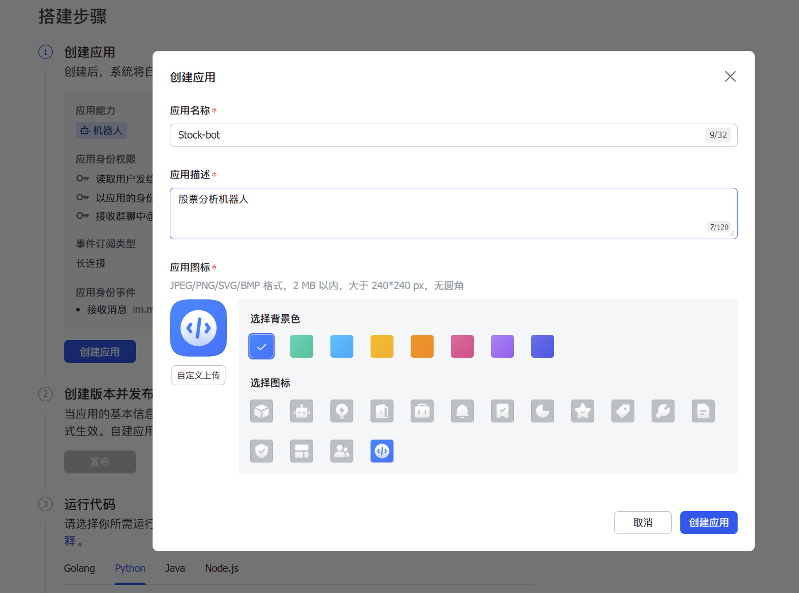
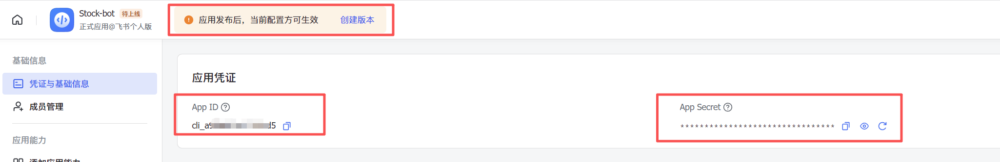
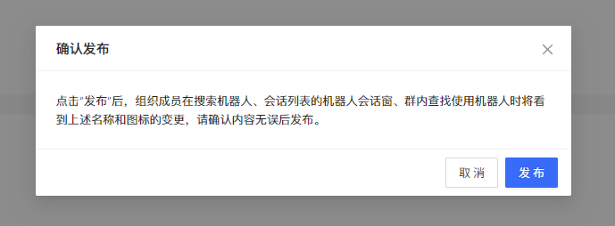
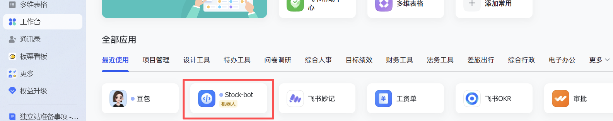
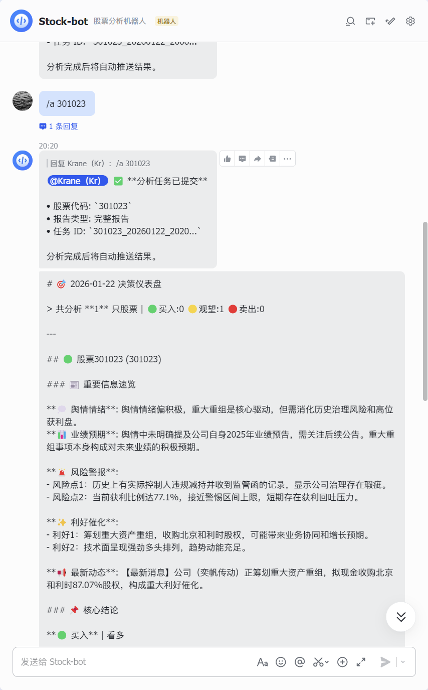

# Leitfaden zur Feishu-Benachrichtigungskonfiguration

Dieses Dokument behandelt nur zwei häufige Anforderungen:

1. Analyseergebnisse in eine Feishu-Gruppe pushen
2. Vermeiden, den Feishu-App-Modus, aktive App-Bot-Pushes und den Gruppenbot-Webhook-Modus zu vermischen

## Zuerst die beiden Modi unterscheiden

### Modus 1: Gruppenbot-Webhook-Push

Anwendungsfälle:
- Du möchtest die Analyseberichte nur in eine Feishu-Gruppe pushen
- Du musst keine Feishu-Message-Callbacks verarbeiten
- Du benötigst keinen Stream Bot

Dies ist zugleich die empfohlene und am einfachsten umsetzbare Feishu-Benachrichtigungsmethode dieses Projekts.

Zu konfigurierende Variablen:

```env
FEISHU_WEBHOOK_URL=https://open.feishu.cn/open-apis/bot/v2/hook/your_hook_token
# 按需填写
FEISHU_WEBHOOK_SECRET=your_sign_secret
FEISHU_WEBHOOK_KEYWORD=股票日报
```

### Modus 2: Feishu-App / App Bot / Stream Bot / Cloud-Dokumente

Anwendungsfälle:
- Du möchtest mit dem Feishu App Bot aktiv Benachrichtigungen an eine bestimmte Gruppe oder einen Nutzer senden
- Du möchtest Bot-Interaktionen in der Feishu-App umsetzen
- Du möchtest den Stream-Modus aktivieren
- Du möchtest die Feishu-Cloud-Dokumentfunktion nutzen

Zugehörige Variablen:

```env
FEISHU_APP_ID=cli_xxx
FEISHU_APP_SECRET=xxx
# App Bot 主动推送时必填
FEISHU_CHAT_ID=oc_xxx
# 私聊时设置 open_id；群聊默认 chat_id
FEISHU_RECEIVE_ID_TYPE=chat_id
# 事件订阅 / Stream Bot 时才开启
FEISHU_STREAM_ENABLED=true
```

Hinweise:
- `FEISHU_APP_ID` / `FEISHU_APP_SECRET` aktivieren nicht direkt den Gruppen-Webhook-Push
- Für einfache Gruppenbenachrichtigungen wird bevorzugt `FEISHU_WEBHOOK_URL` konfiguriert
- Ohne Webhook müssen für den aktiven App-Bot-Push `FEISHU_APP_ID`, `FEISHU_APP_SECRET` und `FEISHU_CHAT_ID` gemeinsam konfiguriert werden
- `FEISHU_STREAM_ENABLED` steht nur für Event-Abo / Stream Bot und fließt nicht in die Beurteilung ein, ob aktive Benachrichtigungen vollständig konfiguriert sind
- Wenn du einen App-Bot / Stream Bot umsetzt, kannst du direkt die am Dokumentende beibehaltenen Screenshots des ursprünglichen Ablaufs als Referenz ansehen
- Der Sendepfad des App Bot nutzt das bereits in `requirements.txt` vorhandene `lark-oapi>=1.0.0`; für die Standardinstallation wird `pip install -r requirements.txt` verwendet; siehe [Feishu message create OpenAPI](https://open.feishu.cn/document/server-docs/im-v1/message/create), [lark-oapi PyPI](https://pypi.org/project/lark-oapi/) und [SDK repo](https://github.com/larksuite/oapi-sdk-python)

### Datei-Sendemodus (FEISHU_SEND_AS_FILE)

Nach dem Aktivieren sendet der Feishu App Bot die Berichte als `.md`-Dateien statt als Text-/Kartennachrichten:

```bash
FEISHU_SEND_AS_FILE=true
```

- **Erforderliche App-Berechtigungen**: `im:message` (Nachrichten senden) + `im:file` (Dateien hochladen)
- **Abhängigkeitsversion**: `lark-oapi>=1.0.0` muss die `im.v1.file.create`-API (Datei-Upload) enthalten
- **Webhook-Modus**: Es wird auf das Senden des Dateiinhalts als Text zurückgefallen (Webhook unterstützt keinen Datei-Upload)
- **Wirkungsbereich**: Gilt nur für Bericht-Pushes mit `route_type="report"`; Alarme, Systembenachrichtigungen usw. sind nicht betroffen
- **GitHub-Actions-Zeitplanaufgaben**: Wurde über `.github/workflows/00-daily-analysis.yml` zugeordnet; füge im Repo unter Settings → Secrets and variables → Actions gleichnamige Variablen oder Secrets hinzu, um es zu aktivieren
- **Konfigurationsmöglichkeiten**: unterstützt `.env`-Dateien, GitHub-Actions-Secrets/-Variablen oder die Web-/Desktop-Einstellungsseite

## Korrekte Konfigurationsschritte für den Webhook-Push

### 1. In der Feishu-Gruppe einen benutzerdefinierten Bot erstellen

Der Pfad ist üblicherweise:
- Gruppenchat
- Gruppeneinstellungen
- Gruppenbot
- Bot hinzufügen
- Benutzerdefinierter Bot

Kopiere anschließend die vom Bot bereitgestellte Webhook-URL.

Beispiel:

```env
FEISHU_WEBHOOK_URL=https://open.feishu.cn/open-apis/bot/v2/hook/xxxxxxxx-xxxx-xxxx-xxxx-xxxxxxxxxxxx
```

### 2. Sicherheitseinstellungen des Bots prüfen

Bei Feishu-Gruppenbots gibt es üblicherweise drei Arten von Sicherheitseinschränkungen:

1. Keine Sicherheitseinstellungen hinzufügen
2. „Stichwort“ aktivieren
3. „Signaturprüfung“ aktivieren

Wenn für deinen Bot zusätzliche Sicherheitselemente aktiviert sind, muss auch das Projekt entsprechend konfiguriert werden, sonst werden Anfragen von Feishu abgelehnt.

#### Stichwort aktiviert

Trage dasselbe Stichwort, das in Feishu konfiguriert ist, ein in:

```env
FEISHU_WEBHOOK_KEYWORD=股票日报
```

Das Projekt setzt dieses Stichwort automatisch vor jede Feishu-Nachricht; du musst die Berichtsvorlage nicht von Hand anpassen.

#### Signaturprüfung aktiviert

Trage das in Feishu angezeigte secret ein in:

```env
FEISHU_WEBHOOK_SECRET=your_sign_secret
```

Das Projekt ergänzt automatisch gemäß den Feishu-Anforderungen für jede Nachricht `timestamp` und `sign`.

### 3. Starten und verifizieren

Sobald `FEISHU_WEBHOOK_URL` konfiguriert ist, läuft das Senden der Benachrichtigungen über den Webhook-Kanal.

Falls du zusätzlich eingetragen hast:

```env
FEISHU_APP_ID=...
FEISHU_APP_SECRET=...
```

beeinflusst das den Webhook-Push nicht; sie können aber `FEISHU_WEBHOOK_URL` nicht ersetzen.

Wenn kein Webhook konfiguriert ist, kann auch mit dem App Bot aktiv gepusht werden:

```env
FEISHU_APP_ID=cli_xxx
FEISHU_APP_SECRET=xxx
FEISHU_CHAT_ID=oc_xxx
FEISHU_RECEIVE_ID_TYPE=chat_id
```

In diesem Fall muss `FEISHU_STREAM_ENABLED` nicht aktiviert werden; es dient nur für Event-Abo / Stream Bot.

### 4. Webhook-Trigger in der Feishu-Automatisierung konfigurieren

Wenn du in Feishu-Automatisierungsabläufen die vom Projekt gepushten Kartennachrichten verarbeitest, konfiguriere wie folgt:

1. Fülle beim Erstellen des Webhook-Triggers die **Parameter** mit dem folgenden JSON aus (`content` kann je nach Bedarf Platzhalter enthalten):

```json
{
  "msg_type": "interactive",
  "card": {
    "config": { "wide_screen_mode": true },
    "elements": [
      {
        "tag": "div",
        "text": {
          "tag": "lark_md",
          "content": "..."
        }
      }
    ],
    "header": {
      "title": {
        "tag": "plain_text",
        "content": "A股智能分析报告"
      }
    }
  }
}
```

2. Trage im Abschnitt **Aktion/Nachrichteninhalt** keinen reinen Text ein; klicke auf das Pluszeichen, wähle **Webhook auslösen** und ordne zu:

`card.elements[0].text.content`



## Die häufigsten Fehlerursachen

### 1. Nur `FEISHU_APP_ID` / `FEISHU_APP_SECRET` ausgefüllt

Symptom:
- Du denkst „Feishu ist eingerichtet“
- Tatsächlich kommen überhaupt keine Gruppenbenachrichtigungen an

Ursache:
- Diese beiden Variablen sind nur App-Anmeldeinformationen; für den aktiven Push wird zusätzlich `FEISHU_CHAT_ID` benötigt, für den Gruppen-Webhook-Push `FEISHU_WEBHOOK_URL`

Richtige Vorgehensweise:
- Einfacher Gruppenpush: `FEISHU_WEBHOOK_URL` ergänzen
- Aktiver App-Bot-Push: `FEISHU_CHAT_ID` ergänzen und bestätigen, dass die App die Berechtigung zum Senden von Nachrichten hat und der Bot in der Zielgruppe ist

### 2. Feishu-Bot hat ein Stichwort aktiviert, aber lokal ist `FEISHU_WEBHOOK_KEYWORD` nicht konfiguriert

Symptom:
- Andere Apps können senden
- Dieses Projekt kann nicht senden, oder Feishu gibt direkt einen Prüfungsfehler zurück

Richtige Vorgehensweise:
- Das Stichwort aus den Sicherheitseinstellungen des Feishu-Bots unverändert in `FEISHU_WEBHOOK_KEYWORD` eintragen

### 3. Feishu-Bot hat die Signaturprüfung aktiviert, aber lokal ist `FEISHU_WEBHOOK_SECRET` nicht konfiguriert

Symptom:
- Die Webhook-URL sieht korrekt aus
- Aber Feishu gibt signaturbezogene Fehler zurück

Richtige Vorgehensweise:
- Das Bot-secret in `FEISHU_WEBHOOK_SECRET` eintragen

### 4. Der Bot ist nicht in der Zielgruppe oder hat keine Schreibberechtigung

Prüfe:
- ob der Bot tatsächlich zur Zielgruppe hinzugefügt wurde
- ob der Gruppenadministrator das Senden von Nachrichten durch den Bot eingeschränkt hat

### 5. Auf Feishu-Seite ist eine IP-Whitelist konfiguriert

Wenn du auf einem Cloud-Server, in Docker oder GitHub Actions läufst, kann die Ausgangs-IP von der lokalen abweichen.

Prüfe:
- ob für den Feishu-Bot eine IP-Whitelist aktiviert ist
- ob die Ausgangs-IP der aktuellen Laufzeitumgebung in der Whitelist steht

## Empfohlene minimale funktionsfähige Konfiguration

### Ohne zusätzliche Sicherheitseinschränkungen

```env
FEISHU_WEBHOOK_URL=https://open.feishu.cn/open-apis/bot/v2/hook/your_hook_token
```

### Stichwort aktiviert

```env
FEISHU_WEBHOOK_URL=https://open.feishu.cn/open-apis/bot/v2/hook/your_hook_token
FEISHU_WEBHOOK_KEYWORD=股票日报
```

### Signaturprüfung aktiviert

```env
FEISHU_WEBHOOK_URL=https://open.feishu.cn/open-apis/bot/v2/hook/your_hook_token
FEISHU_WEBHOOK_SECRET=your_sign_secret
```

### Stichwort und Signatur gleichzeitig aktiviert

```env
FEISHU_WEBHOOK_URL=https://open.feishu.cn/open-apis/bot/v2/hook/your_hook_token
FEISHU_WEBHOOK_SECRET=your_sign_secret
FEISHU_WEBHOOK_KEYWORD=股票日报
```

## Empfohlene Reihenfolge der Fehlersuche

1. Kläre zuerst, ob du „Gruppen-Webhook-Push“ oder „App / Stream Bot“ möchtest.
2. Für einen einfachen Gruppenpush stelle zuerst sicher, dass `FEISHU_WEBHOOK_URL` konfiguriert ist.
3. Wenn du ohne Webhook den aktiven App-Bot-Push nutzt, stelle sicher, dass `FEISHU_APP_ID` / `FEISHU_APP_SECRET` / `FEISHU_CHAT_ID` vollständig vorhanden sind.
4. Kehre zu den Sicherheitseinstellungen des Feishu-Bots zurück und prüfe, ob ein Stichwort oder eine Signatur aktiviert ist.
5. Falls aktiviert, ergänze `FEISHU_WEBHOOK_KEYWORD` / `FEISHU_WEBHOOK_SECRET`.
6. Prüfe zuletzt, ob der Bot in der Gruppe ist, ob er Berechtigungen hat und ob die IP-Whitelist greift.

## Anhang: Screenshots des ursprünglichen Ablaufs für App / Stream Bot als Referenz

Wenn du nicht nur den Gruppen-Webhook-Push umsetzt, sondern weiterhin eine Feishu-App, einen Long-Connection-Bot oder Cloud-Dokumente konfigurieren möchtest, kannst du die folgende Gruppe von Originalscreenshots als Referenz verwenden.

### 1. App erstellen

https://open.feishu.cn/document/develop-an-echo-bot/introduction





### 2. Secret abrufen



### 3. App veröffentlichen



### 4. Die App in Feishu öffnen



### 5. Nachrichteninteraktion


