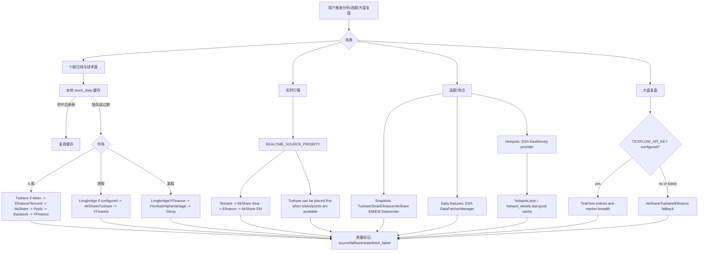
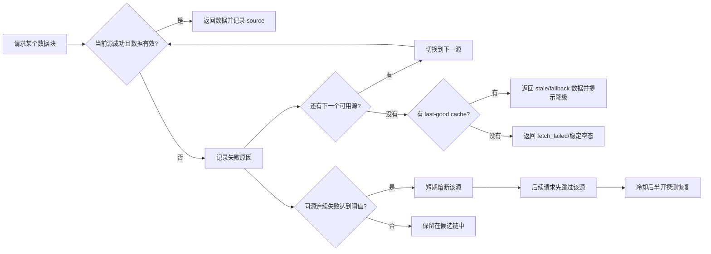
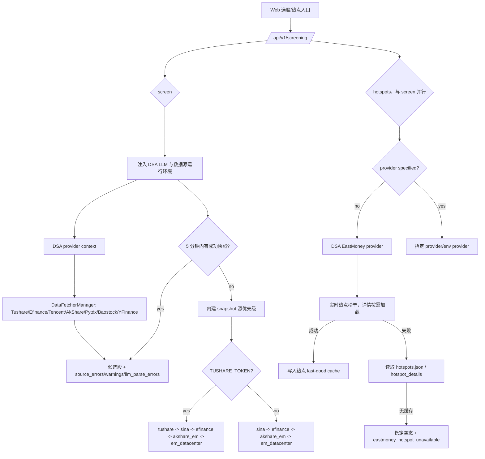

# Übersicht zur Stabilität der Datenquellen und zur Fehlerbehandlung

Dieser Artikel richtet sich an Benutzer, Bereitsteller und Wartende und erläutert, wie die von DSA angebundenen Datenquellen an Analyse, Aktienauswahl und Marktreview teilnehmen sowie wie das System degradiert, wenn eine Datenquelle fehlschlägt.

Kernprinzip: Zuerst die bereits angebundenen und verifizierten Datenquellen des Projekts nutzen und die Fehlerpfade klar erklären; das Hinzufügen neuer externer Datenquellen sollte in einer zweiten Phase erfolgen, um die Wartungsfläche nicht vorzeitig zu vergrößern.

## Die Antwort an Benutzer in einem Satz

Wenn „Datenquellenfehler" auftritt, bedeutet das meist nicht, dass das System nur eine Quelle nutzen kann, sondern dass eine freie Quelle ratelimited ist, sich eine Upstream-Schnittstelle temporär geändert hat, das Netz schwankt oder der aktuelle Markt/Wert nicht unterstützt wird. DSA verfügt bereits über einen eingebauten Multi-Datenquellen-Fallback und versucht automatisch die nächste Quelle je nach Szenario; wer mehr Stabilität wünscht, sollte mindestens eine stabile Token-Quelle konfigurieren:

- A-Aktien-Einzelaktien und eingebaute Aktienauswahl: vorrangig `TUSHARE_TOKEN` konfigurieren und AkShare / Efinance / Tencent / Baostock / YFinance als Fallback behalten.
- A-Aktien-Marktreview: nach Konfiguration von `TICKFLOW_API_KEY` werden Index und Marktbreite vorrangig über TickFlow versucht; bei Fehlschlag wird auf die vorhandenen freien Quellen zurückgefallen.
- Hongkong-/US-Aktien: nach Konfiguration von `LONGBRIDGE_*` wird vorrangig Longbridge verwendet; YFinance, Finnhub, AlphaVantage bleiben als Fallback.
- Hot-Topics: Die Hotspot-Implementierung der eingebauten Aktienauswahl orientiert sich an AlphaSift, nutzt standardmäßig den DSA-EastMoney-Provider und verwendet einen lokalen last-good-Cache, um die Auswirkungen von Echtzeit-Schnittstellenfehlern zu reduzieren.

## Matrix der angebundenen Datenquellen

| Szenario | Angebundene Quellen | Standard-Verwendungsweise | Fehlerbehandlung |
| --- | --- | --- | --- |
| A-Aktien-Tageslinien / technische Analyse | Efinance, Tencent, AkShare, Tushare, Pytdx, Baostock, YFinance | `DataFetcherManager` versucht nach Priorität; nach Konfiguration von `TUSHARE_TOKEN` tritt Tushare automatisch in die Kandidatenquellen ein | Nach Fehlschlag einer einzelnen Quelle wird die nächste versucht; bei wiederholten Fehlschlägen wird die Quelle kurzzeitig abgeschaltet (Circuit Breaker) |
| A-Aktien-Echtzeit-Kursdaten | Tencent, AkShare Sina, Efinance, AkShare EM, Tushare | `REALTIME_SOURCE_PRIORITY` steuert die Reihenfolge; standardmäßig werden leichte Quellen wie Tencent / Sina bevorzugt | Fehlgeschlagene Quellen protokollieren `fallback_from`; erfolgreiche Quellen liefern weiter zurück |
| A-Aktien-Marktreview | TickFlow, AkShare, Tushare, Efinance | Nach Konfiguration von `TICKFLOW_API_KEY` werden Hauptindizes und Marktbreite vorrangig über TickFlow versucht | Bei unzureichenden TickFlow-Berechtigungen oder Fehlschlag wird auf die AkShare / Tushare / Efinance-Kette zurückgefallen |
| Snapshot der eingebauten Aktienauswahl | Tushare, Sina, Efinance, AkShare EM, EastMoney Datacenter | Bei vorhandenem `TUSHARE_TOKEN` wird `tushare` automatisch in die Snapshot-Priorität aufgenommen; sonst wird die freie Quellenkette verwendet | Die eingebaute Engine pflegt die source health; die DSA-Status-Schnittstelle gibt snapshot/daily health aus |
| Tageslinien-Feature-Ergänzung der eingebauten Aktienauswahl | DSA `DataFetcherManager` | Die eingebaute Engine ruft den DSA-Provider-Kontext auf und nutzt vorrangig die DSA-Tageslinien- und Cache-Kette wieder | Erst nach Fehlschlag der DSA-Kette wird auf die eigene Tageslinienquelle der Engine zurückgefallen |
| Hot-Topics der eingebauten Aktienauswahl | DSA-EastMoney-Provider, an AlphaSift orientierte Hotspot-Implementierung, last-good cache | Ohne Angabe eines Providers wird standardmäßig der DSA-EastMoney-Provider verwendet | Bei Echtzeit-Fehlschlag wird auf den Hotspot-Cache zurückgefallen; ohne Cache wird ein stabiler leerer Zustand und ein lesbarer Fehler zurückgegeben |
| Hongkong-/US-Aktien | Longbridge, YFinance, AkShare, Tushare, Finnhub, AlphaVantage, Stooq | Nach Konfiguration der Longbridge-Zugangsdaten nimmt es am Tageslinien-/Echtzeit-Fallback für HK/US teil; YFinance bleibt der Basis-Fallback | Bei Longbridge-Cooldown oder Fehlschlag wird auf YFinance / andere verfügbare Quellen zurückgefallen |

## Gesamtes Ablaufdiagramm



## Fehler- und Degradierungsdiagramm



Die aktuelle Circuit-Breaker-Strategie für Tageslinienquellen schaltet nach 3 aufeinanderfolgenden Fehlschlägen für etwa 5 Minuten in einen kurzen Cooldown. Ihr Zweck ist nicht, eine Datenquelle dauerhaft zu deaktivieren, sondern zu vermeiden, dass eine kurzzeitig nicht verfügbare Quelle die gesamte Batch-Analyse verlangsamt.

## Kette der eingebauten Aktienauswahl und Hot-Topics



## Empfohlene Konfigurationsprofile

### Kostenloser Modus

Geeignet für persönliche Testnutzung; verlässt sich auf den automatischen Fallback freier Quellen. Vorteil: kein Token nötig; Nachteil: Upstream-Rate-Limits oder temporäre Schnittstellenänderungen treten leichter auf.

```env
REALTIME_SOURCE_PRIORITY=tencent,akshare_sina,efinance,akshare_em
ENABLE_EASTMONEY_PATCH=true
```

### Stabiler Modus für A-Aktien

Geeignet für häufige Aktienauswahl, Batch-Analyse oder externe Dienste. Tushare verbessert die Stabilität von A-Aktien-Tageslinien und Snapshots; TickFlow kann A-Aktien-Tages-K-Linien, Echtzeit-Kursdaten und Marktreview verbessern (Echtzeit-Kursdaten müssen explizit in `REALTIME_SOURCE_PRIORITY` aufgenommen werden); freie Quellen bleiben als Fallback bestehen.

```env
TUSHARE_TOKEN=your_tushare_token
TICKFLOW_API_KEY=your_tickflow_key

REALTIME_SOURCE_PRIORITY=tickflow,tushare,tencent,akshare_sina,efinance,akshare_em
SNAPSHOT_SOURCE_PRIORITY=tushare,sina,efinance,akshare_em,em_datacenter

# 选股运行期默认值；显式配置时会保留你的值
DAILY_FETCH_RETRIES=3
DAILY_FETCH_MAX_WORKERS=1
```

Hinweis: Die TickFlow-Fähigkeiten sind nach Paketberechtigungen gestaffelt; bei unzureichenden Berechtigungen oder fehlgeschlagenen Anfragen wird fail-open auf die vorhandenen freien Quellen zurückgefallen; es wird nicht empfohlen, es als einzige Quelle für alle Marktkursdaten zu betrachten.

### Stabiler Modus für Hongkong-/US-Aktien

Geeignet für HK/US-Portfolio, Positionen und Einzelaktien-Analyse. Nach der Konfiguration nimmt Longbridge vorrangig an der HK/US-Kette teil; YFinance, Finnhub, AlphaVantage dienen als Fallback.

```env
LONGBRIDGE_OAUTH_CLIENT_ID=your_client_id
LONGBRIDGE_OAUTH_TOKEN_CACHE_B64=your_token_cache_base64

FINNHUB_API_KEY=your_finnhub_key
ALPHAVANTAGE_API_KEY=your_alphavantage_key
```

Falls weiterhin Legacy-Longbridge-Zugangsdaten verwendet werden, kann auch Folgendes konfiguriert werden:

```env
LONGBRIDGE_APP_KEY=your_app_key
LONGBRIDGE_APP_SECRET=your_app_secret
LONGBRIDGE_ACCESS_TOKEN=your_access_token
```

## Empfehlungen für benutzersichtbare Hinweise

Bei der Kommunikation nach außen wird empfohlen, drei Situationen zu unterscheiden:

| Situation | Empfohlener Hinweis |
| --- | --- |
| Einzelne Quelle fehlgeschlagen, aber Fallback erfolgreich | Diesmal wurde eine degradierte Datenquelle verwendet; die Analyse kann fortgesetzt werden; der Bericht markiert die tatsächlich erfolgreiche Quelle. |
| Mehrere Quellen fehlgeschlagen, aber Cache vorhanden | Die Echtzeitquelle ist nicht verfügbar; diesmal wird der letzte erfolgreiche Cache verwendet; die Konklusion erhält eine reduzierte Konfidenz. |
| Alle Quellen fehlgeschlagen und kein Cache | Aktuelle Daten sind nicht verfügbar; bitte später erneut versuchen oder Token-Datenquellen wie Tushare / TickFlow / Longbridge konfigurieren. |

## Mögliche spätere Produktverbesserungen

1. Datenquellen-Doctor-Seite: Anzeige des letzten Erfolgszeitpunkts jeder Quelle, der Fehlerursache, des Circuit-Breaker-Status und des nächsten Zeitpunkts der Wiederherstellungsprobe.
2. Ein-Klick-Empfehlungskonfiguration: Erzeugt `.env`-Ausschnitte je nach Marktwahl, z. B. „Stabiler Modus für A-Aktien", „Stabiler Modus für Hongkong-/US-Aktien", „Kostenloser Modus".
3. Statuspanel der eingebauten Aktienauswahl: zeigt die snapshot/daily source health direkt an, sodass Benutzer wissen, ob Sina, Efinance, AkShare oder Tushare das Problem ist.
4. Rate-Limiting-Strategie für Batch-Tasks: für freie Quellen die Parallelität automatisch senken, bevorzugt lokale Tageslinien-Caches wiederverwenden und so Upstream-Rate-Limits seltener auslösen.
5. Einbindung optionaler kommerzieller Quellen: Erst wenn die vorhandenen Tushare / TickFlow / Longbridge / Finnhub / AlphaVantage den Bedarf weiterhin nicht abdecken, sollte erwogen werden, Quellen wie Twelve Data, Massive/Polygon, Nasdaq Data Link hinzuzufügen.

## Offizielle Dokumentation

- Tushare: https://tushare.pro/document/2
- TickFlow: https://tickflow.org/
- AkShare: https://akshare.akfamily.xyz/
- Longbridge OpenAPI: https://open.longportapp.com/
- Finnhub API: https://finnhub.io/docs/api
- Alpha Vantage API: https://www.alphavantage.co/documentation/
