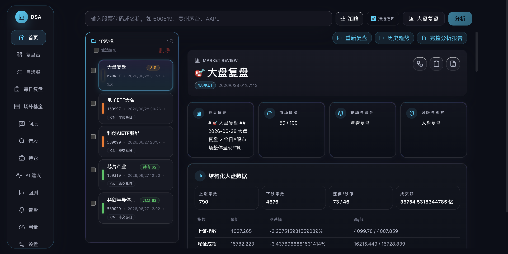
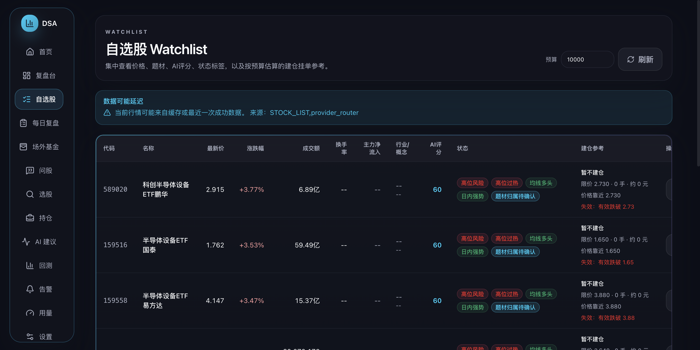
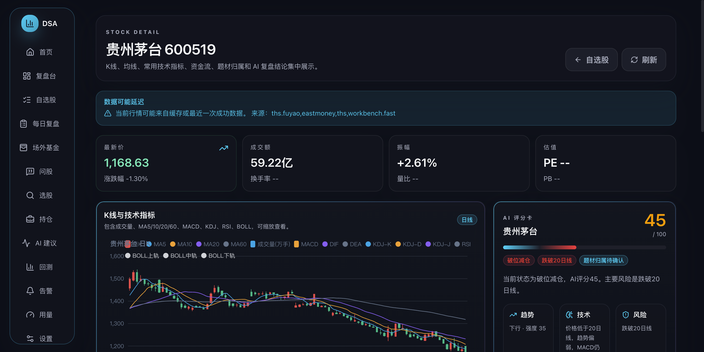
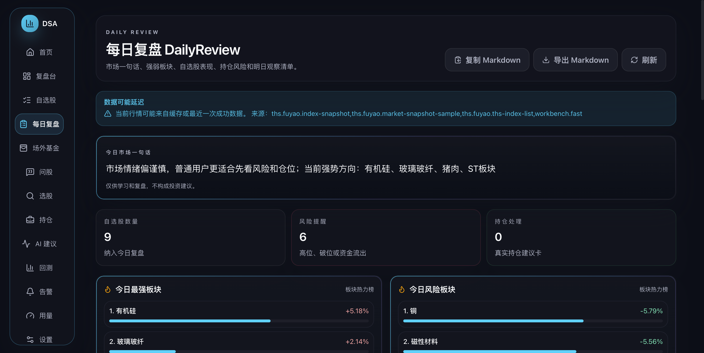
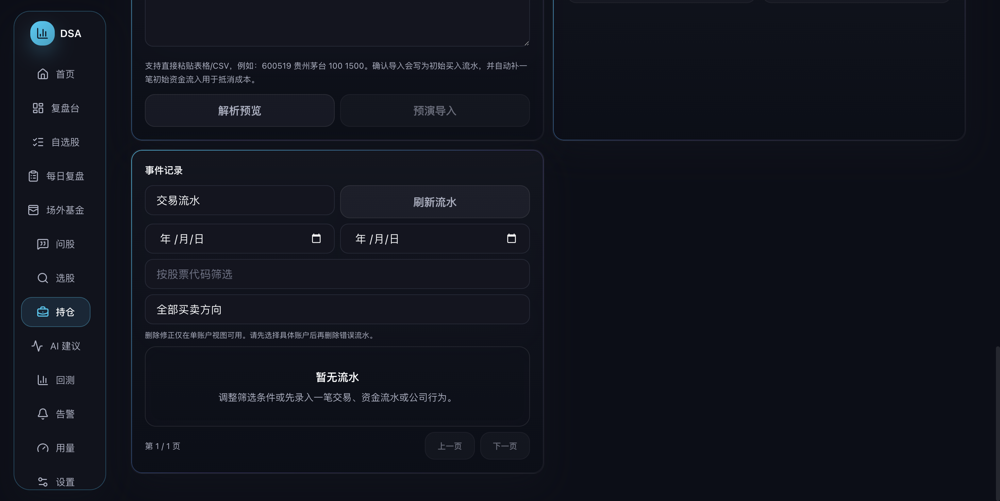
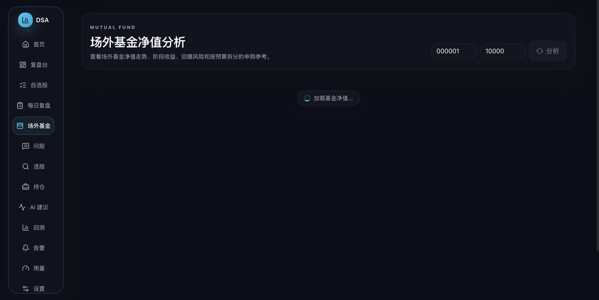

# AI 股票复盘工作台 MVP 版本说明

发布日期：2026-06-27

本版本在 `daily_stock_analysis` 现有后端、WebUI、FastAPI、Docker、定时任务、LLM 分析和推送能力之上，做最小增量改造，新增面向普通 A 股用户的 AI 股票复盘工作台 MVP。目标是把指数、板块、自选股、个股技术面和 AI 复盘结论用更直观的方式展示出来，而不是改造成复杂量化终端。

## 新增页面

- 市场总览 Dashboard：展示上证指数、深证成指、创业板指、成交额、涨跌家数、涨停/跌停、强势行业、强势概念和 AI 市场情绪总结。
- 自选股 Watchlist：展示股票代码、名称、最新价、涨跌幅、成交额、换手率、主力净流入、行业、概念、AI 评分和状态标签。
- 个股详情 StockDetail：展示顶部行情卡片、ECharts K 线图、成交量、MA5/10/20/60、MACD、KDJ、RSI、BOLL、资金流、行业/概念、AI 评分卡、风险提示、明日观察位和 AI 分析报告。
- 每日复盘 DailyReview：展示今日市场一句话、最强板块、风险板块、自选股表现、持仓风险、明日观察清单、AI 总结，并支持导出 Markdown。

## 新增后端能力

- 新增 `data_provider/eastmoney_provider.py`，封装东方财富实时行情、日 K、资金流、龙虎榜、涨停池和个股新闻。
- 新增 `data_provider/ths_provider.py`，封装同花顺行业板块、概念板块、板块成分股和个股题材推断。
- 新增 `data_provider/provider_router.py`，作为工作台数据聚合路由，优先复用新增数据源，并在失败时回退到项目现有数据源能力。
- 新增 `src/services/workbench_service.py`，聚合市场总览、自选股、个股详情和每日复盘所需数据，并生成符合 MVP 要求的 AI 评分结构。
- 新增 `/api/v1/workbench` API 分组，提供 dashboard、watchlist、stock detail、daily review 和 Markdown 导出接口。

## 新增 Skill

- 新增 `skills/eastmoney_skill/`：记录东方财富数据源在本项目中的使用边界、失败降级和字段约定。
- 新增 `skills/ths_skill/`：记录同花顺行业/概念数据源在本项目中的使用边界、失败降级和题材推断约定。
- 扩展原 Skill 扫描逻辑，使项目根目录 `skills/` 可以和既有 `strategies/` 一起被发现。

## 前端体验优化

- 新增 ECharts K 线组件和资金流图表组件，支持普通用户查看趋势、成交量和资金变化。
- 新增 AI 评分卡组件，将趋势、技术面、资金面、板块热度、风险和操作参考集中展示。
- 新增板块热力榜组件，用涨跌幅、成交额和热度信息展示强势方向。
- 新增风险标签组件，统一展示红色风险、绿色机会、蓝色/灰色观察标签。
- 新增数据状态提示，接口异常或读取缓存时在页面展示“数据延迟/接口异常”信息。
- 保留默认浅色模式，并在样式结构上保留后续深色模式扩展点。

## 稳定性与合规边界

- 所有新增数据源函数都做 `try/except` 包裹。
- 新增数据源返回结构统一包含 `source`、`stale`、`error` 和 `data`，单个接口失败不会让整体页面崩溃。
- 实时接口失败时优先回退到项目现有缓存、SQLite 或既有 `DataFetcherManager` 能力。
- 所有 AI 分析输出都带免责声明：`仅供学习和复盘，不构成投资建议。`
- 本版本不做自动交易、不接券商接口、不承诺收益。

## Docker 与部署调整

- Docker 镜像构建时复制项目根目录 `skills/`，保证新增 Skill 在线上容器可用。
- 将 `longbridge` 依赖固定到当前包索引可安装的 `0.2.74`，避免部署时因依赖版本不可用导致镜像构建失败。
- 东京服务器已完成替换部署，`stock-server` 容器健康运行，`stock.riskcustoms.com` 已指向新工作台版本。

## 运行入口

- WebUI：登录后访问 `/workbench` 查看市场总览。
- 自选股：`/workbench/watchlist`。
- 个股详情：`/workbench/stocks/{symbol}`，例如 `/workbench/stocks/600519`。
- 每日复盘：`/workbench/daily-review`，页面内可导出 Markdown。

## 页面截图

| 页面 | 截图 |
|------|------|
| 市场总览 Dashboard |  |
| 自选股 Watchlist |  |
| 个股详情 StockDetail |  |
| 每日复盘 DailyReview |  |
| 持仓操作建议卡 |  |
| 场外基金分析 |  |
